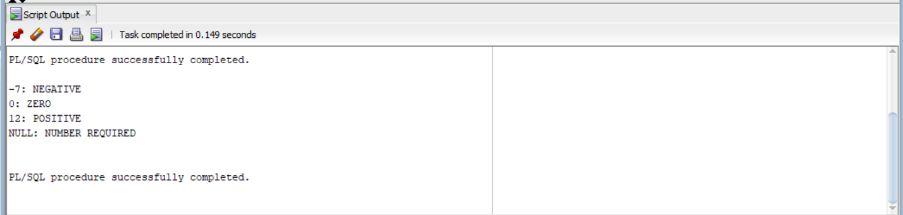
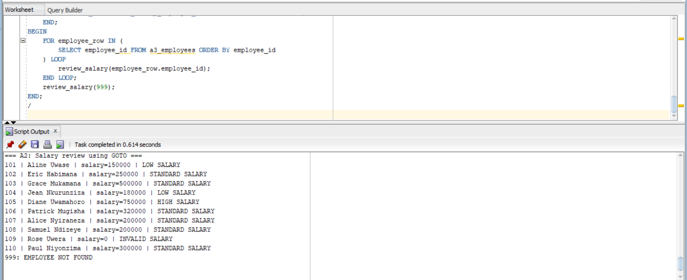
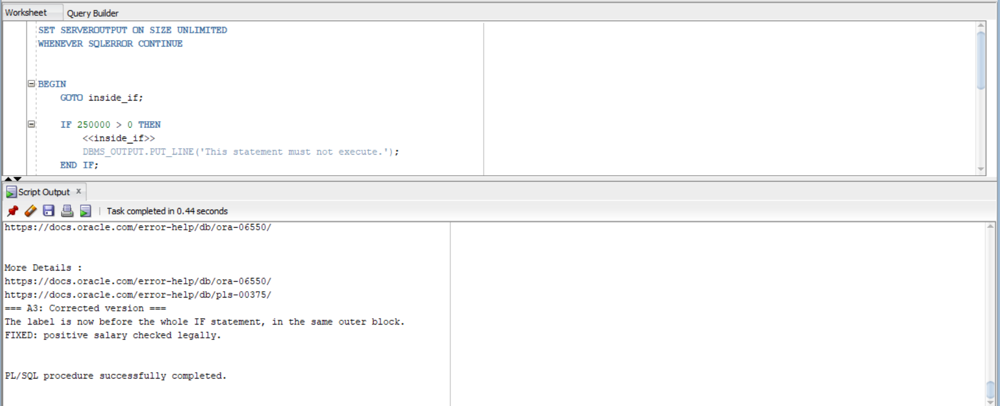
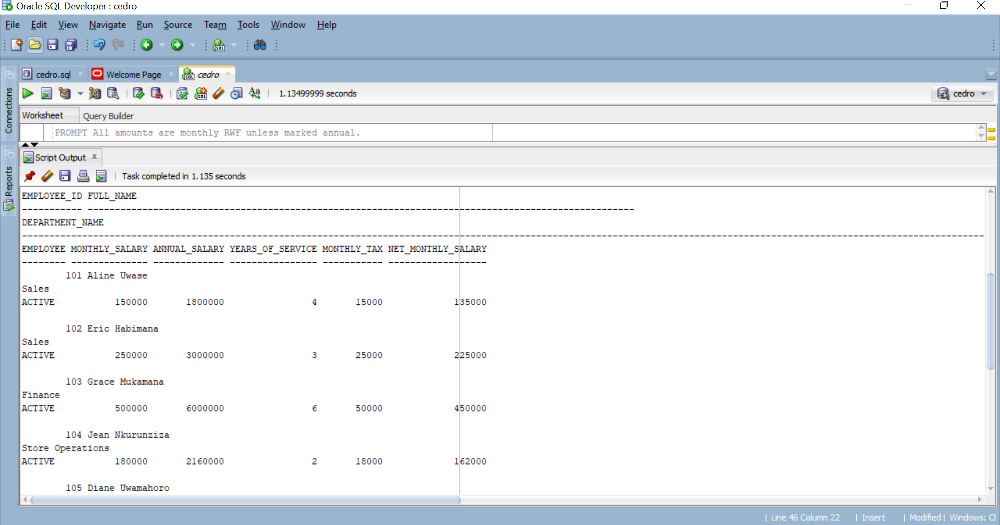
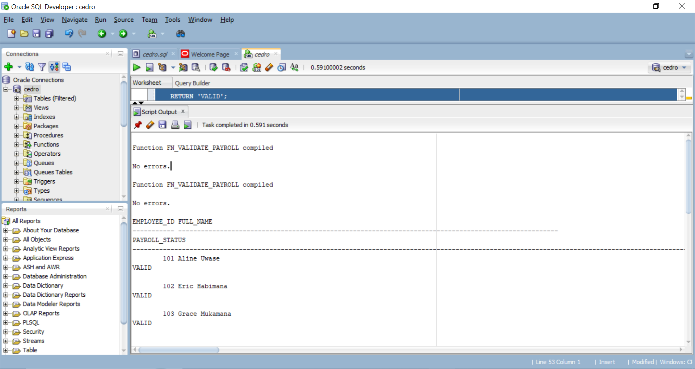

# Individual Assignment III — Shop Staff Payroll

**Course:** Database Development with PL/SQL (INSY 8311)  
**Instructor:** Eric Maniraguha  
**Student name:** Irakoze peace cedrick 
**Student ID:** 20251sen259
**Project:** A small shop's staff payroll  
**Target database:** Oracle Database 21c

Rename this folder and the public GitHub repository to:
`plsql-goto-functions-20251sen259-Irakoze`.
Replace the angle-bracket placeholders with actual values.

## Project idea

A shop has employees working in Sales, Finance, and Store Operations. Each
employee belongs to one department. The project reviews monthly salaries,
calculates annual salaries and example monthly tax, measures service, and
checks whether an employee's payroll record is valid.

Only two tables are needed: `a3_departments` and `a3_employees`.
The setup creates 3 departments and 10 employees. All names and salaries
are fictional classroom data.

The assignment PDF provides task titles and a required file structure, but
does not provide detailed tax bands, salary thresholds, or function signatures.
The choices used here are documented in [PROJECT_RULES.md](docs/PROJECT_RULES.md).
If the instructor provides further task rules, those take precedence.

**The tax bands are invented for this assignment. They are not official
Rwanda tax rates.** All amounts use RWF. Tax is calculated monthly.

## Task coverage

| Task | What it demonstrates | File |
| --- | --- | --- |
| A1 | Negative, zero, positive, and missing numbers using labels | `01_goto/A1_number_classifier.sql` |
| A2 | Salary review using GOTO | `01_goto/A2_salary_review.sql` |
| A3 | An illegal jump into IF and a corrected jump | `01_goto/A3_illegal_goto.sql` |
| A4 | The same salary review using IF/ELSIF/ELSE | `01_goto/A4_rewrite_no_goto.sql` |
| B1 | Annual salary with input validation | `02_functions/B1_fn_annual_salary.sql` |
| B2 | Completed years of service | `02_functions/B2_fn_years_of_service.sql` |
| B3 | Progressive example monthly tax | `02_functions/B3_fn_calculate_tax.sql` |
| B4 | Department lookup and NO_DATA_FOUND | `02_functions/B4_fn_dept_name.sql` |
| B5 | Four stored functions in a SELECT | `03_tests/B5_functions_in_select.sql` |
| C1 | Payroll validation using GOTO and B1–B3 | `02_functions/C1_fn_validate_payroll.sql` |
| C2 | Reflection on control flow, functions, and validation | `docs/REFLECTION.md` |

## Repository files

The required directories are `00_setup`, `01_goto`, `02_functions`,
`03_tests`, `screenshots`, and `docs`. The root contains this README,
`.gitignore`, and the optional SQL*Plus runner `run_all.sql`.

Extra documentation explains the project rules, expected results,
how to capture screenshots, and the concepts to prepare for the quiz.

## How to run in SQL Developer on Windows

1. Extract the ZIP and open the project folder.
2. Open SQL Developer and connect to the student/lab schema in the intended
   pluggable database. The account needs `CREATE TABLE`, `CREATE PROCEDURE`,
   and sufficient tablespace quota. Stored functions use the
   `CREATE PROCEDURE` privilege.
3. Open `00_setup/create_tables.sql` and press **F5 (Run Script)**.
   Expect 3 departments and 10 employees. Run setup once. It does not drop
   or recreate existing tables; a second run will encounter existing objects.
4. Open and run the five function files with **F5**, in this order:
   B1, B2, B3, B4, and C1. Each file ends with `SHOW ERRORS`.
   The four B functions must exist before C1 is compiled.
5. Run A1, A2, A3, and A4 with **F5**, one file at a time.
   A3's first block is deliberately illegal. Its compiler error is expected.
   The second block should print the corrected result.
6. Run `03_tests/test_functions.sql`,
   `03_tests/B5_functions_in_select.sql`, and
   `03_tests/test_validate_payroll.sql` with **F5**.
7. Compare the output with [EXPECTED_RESULTS.md](docs/EXPECTED_RESULTS.md).
   If an assertion fails, read its `FAIL` message and correct the problem
   before taking the final evidence screenshots.
8. Capture the six screenshots described in
   [screenshots/README.md](screenshots/README.md).

Use **F5**, because these files contain multiple statements, `/` delimiters,
and script commands such as `SET SERVEROUTPUT ON`.
`DBMS_OUTPUT.PUT_LINE` messages appear in Script Output when server output
is enabled. If the separate DBMS Output panel is used, enable it for the
active connection.

## How to run in SQL*Plus

Connect to the same lab schema without putting passwords in the repository.
For a new setup, start the runner using the full path on the computer, for example:

```sql
@"C:\Users\YOUR_WINDOWS_USER\Documents\plsql-goto-functions-YOUR_ID-YOUR_FIRSTNAME\run_all.sql"
```

Replace the path with the extracted folder's real location.
The runner creates tables, compiles functions, checks their status, and
runs the normal programs and assertions. It stops on unexpected SQL errors.
It uses `@@` so child paths resolve from the runner's directory.

Run A3 separately afterwards, using its full path:

```sql
@"C:\Users\YOUR_WINDOWS_USER\Documents\plsql-goto-functions-YOUR_ID-YOUR_FIRSTNAME\01_goto\A3_illegal_goto.sql"
```

**A3 is intentionally excluded from the normal runner.** Its first block
must fail to demonstrate the restriction; its second block is the fix.

For later runs after setup, run the individual files. `CREATE OR REPLACE`
lets the functions be recompiled. Do not rerun table creation blindly.

## Compilation and test checkpoints

Check the five functions after compiling:

```sql
SELECT object_name, status
FROM user_objects
WHERE object_type = 'FUNCTION'
  AND object_name IN (
      'FN_ANNUAL_SALARY', 'FN_YEARS_OF_SERVICE', 'FN_CALCULATE_TAX',
      'FN_DEPT_NAME', 'FN_VALIDATE_PAYROLL'
  )
ORDER BY object_name;
```

Every returned status must be `VALID`. A “created with compilation errors”
message is not a successful compilation.

With the supplied seed data and rules, the expected final assertion messages are:

```text
All 28 function tests passed.
All 14 payroll tests passed.
```

These are **expected messages, not recorded execution evidence**.
The prepared package has not been executed against Oracle in this workspace.
Run it on Oracle and record the actual outcome below.

| Check | Result to record after running |
| --- | --- |
| Setup: 3 departments and 10 employees | Pending local execution |
| Five stored functions are VALID | Pending local execution |
| B1–B4 assertions | Pending local execution |
| C1 assertions | Pending local execution |
| A2 and A4 have identical review lines | Pending local execution |
| A3 shows the expected error and working fix | Pending local execution |

The future-hire row is protected with `CASE` in B5, so the service function
is called only when its input date is valid. The row remains visible in
the report with a NULL service value. C1 explains why it cannot be paid.

## Screenshots

The six required images are initially absent. Capture actual Oracle output;
the expected-results document is a comparison reference.

Once the images are saved using these exact names, GitHub will display them here.

### A1



### A2



### A3


### A4



### B5



### C1



## GitHub submission

The assignment requires a **public** GitHub repository, all required files,
six genuine screenshots, and **at least five meaningful commits**.
If using GitHub's website, upload the contents of this project folder at
the repository root. Avoid an extra nested copy of the project folder.

Build the commit history as the work is reviewed and run. These are suggested
groups and messages; no commits have been created in this package:

| Commit | Files and purpose | Suggested message |
| --- | --- | --- |
| 1 | Setup and documented scenario rules | Add shop payroll schema and sample employees |
| 2 | A1–A4 control-flow demonstrations | Add GOTO examples and structured salary review |
| 3 | B1–B4 stored functions | Add salary, service, tax and department functions |
| 4 | C1, tests, B5, and optional runner | Add payroll validation and assertion tests |
| 5 | Reviewed README, reflection, and genuine screenshots | Document results and add Oracle evidence |

Update student identity, personalize the reflection, and record real test
results before submitting. Review the repository while signed out to confirm
it is public and the screenshot images display correctly.

The uploaded assignment states the deadline as **Thursday, 8 October 2026,
11:59 PM**. Submit the public repository link through the instructor's
Google Form. Email submission is not accepted.

The link printed in the assignment is:
[assignment submission form](https://docs.google.com/forms/d/1jAhJEeb3JqXT-HC7CpTwmGIEffE9h5ixaqw3m2p1yoc/edit).
Use the instructor's student-facing form link if this printed URL requires
editing permission.

## Notes — AI assistance

ChatGPT assisted with selecting the scenario, drafting the schema and PL/SQL
scripts, preparing test cases, and explaining the concepts. The student is
responsible for running, reviewing, understanding, and explaining the code,
and for supplying genuine screenshots and an accurate reflection.

This disclosure is included because the assignment explicitly asks students
to mention AI assistance in the Notes section. Keep it accurate if the work
is changed further.

## Oracle references

- [GOTO restrictions](https://docs.oracle.com/en/database/oracle/oracle-database/21/lnpls/GOTO-statement.html)
- [PL/SQL control statements](https://docs.oracle.com/en/database/oracle/oracle-database/21/lnpls/plsql-control-statements.html)
- [MONTHS_BETWEEN](https://docs.oracle.com/en/database/oracle/oracle-database/21/sqlrf/MONTHS_BETWEEN.html)
- [Stored functions invoked from SQL](https://docs.oracle.com/en/database/oracle/oracle-database/21/adfns/coding-subprograms-and-packages.html)
- [PL/SQL compiler errors, including PLS-00375](https://docs.oracle.com/en/database/oracle/oracle-database/21/errmg/PLS-00001.html)

## Final checklist

- [ ] Correct student name, ID, and repository name
- [ ] Public repository
- [ ] All required SQL files uploaded
- [ ] Five functions compile as VALID
- [ ] All assertions run successfully
- [ ] A3 error and fix demonstrated
- [ ] Six genuine screenshots added and displayed
- [ ] README execution results updated
- [ ] Reflection reviewed and personalized
- [ ] At least five meaningful commits
- [ ] AI assistance accurately disclosed
- [ ] GitHub link submitted through the Google Form before the deadline
- [ ] Able to explain the code for the class quiz
"# plsql-goto-functions-20251sen259-irakoze" 
